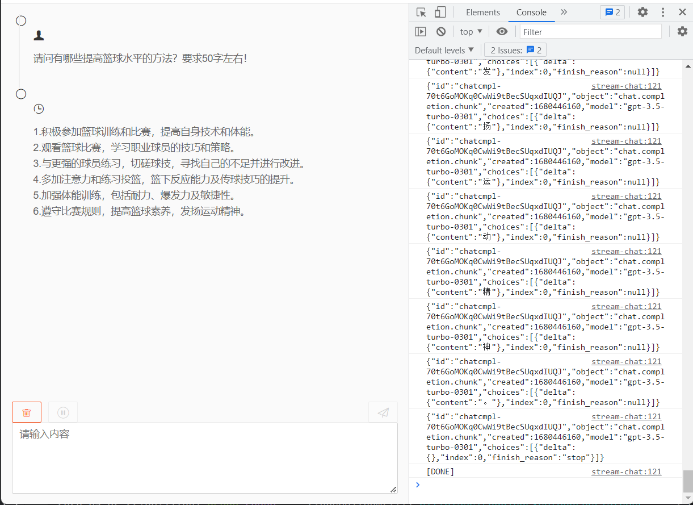

[](https://github.com/lzhpo/chatgpt-spring-boot-starter/actions/workflows/style-check.yml)

## 概览

1. 支持设置多个 API Key，并且支持对其设置权重，以及是否启用
2. 支持设置请求代理
3. 支持自定义请求 API（如果对 OpenAi 的 API 做了中转/代理）
4. 支持OpenAi所有可以使用 API Key 访问的 API
5. 支持流式响应，即所谓的"打字机"模式
6. 请求参数自动校验

## 支持的功能

- [x] 模型查询（Model）
- [x] 流式/非流式对话聊天（Completion / Chat completion）
- [x] 根据提示生成文本（Edit）
- [x] 自然语言转换为向量表示
- [x] 音频/视频语音转文本（Create transcription）
- [x] 文本翻译（Create translation）
- [x] 文件的查询、上传、删除（File - List/Upload/Delete/Retrieve）
- [x] 预训练模型的训练、查询、放弃、事件（Fine-tunes - Create/List/Retrieve/Cancel/Events）
- [x] 内容审核（Moderation）
- [x] 用户余额查询（Billing credit grants）
- [x] 用户信息查询（User）
- [x] 图像（Image）
  - [x] 根据提示创建图像（Create image）
  - [x] 根据提示编辑图像（Create image edit）
  - [x] 根据提供的图像生成多个变化版本的图像（Create image variation）

## 导入依赖

```xml
<dependency>
  <groupId>com.lzhpo</groupId>
  <artifactId>chatgpt-spring-boot-starter</artifactId>
  <version>${version}</version>
</dependency>
```

## 配置示例

### 1.支持配置多个 API Key（权重、是否启用）

> 可以对当前 api key 设置权重，以及是否需要启用此 api key

```yaml
openai:
  keys:
    - key: "sk-xxx1"
      weight: 1.0
      enabled: true
    - key: "sk-xxx2"
      weight: 2.0
      enabled: false
    - key: "sk-xxx3"
      weight: 3.0
      enabled: true
```

### 2.支持配置代理

```yaml
openai:
  proxy:
    host: "127.0.0.1"
    port: 7890
    type: http
    connect-timeout: 1m
    read-timeout: 1m
    write-timeout: 1m
    username: admin
    password: 123456
```

### 3.支持自定义请求API

以下是当前支持的所有OpenAi的接口的默认配置，如果对OpenAi的接口做了中转就可以在此处自定义配置。

```yaml
openai:
  urls:
    moderations: "https://api.openai.com/v1/moderations"
    completions: "https://api.openai.com/v1/completions"
    edits: "https://api.openai.com/v1/edits"
    chat-completions: "https://api.openai.com/v1/chat/completions"
    list-models: "https://api.openai.com/v1/models"
    retrieve-model: "https://api.openai.com/v1/models/{model}"
    embeddings: "https://api.openai.com/v1/embeddings"
    list-files: "https://api.openai.com/v1/files"
    upload-file: "https://api.openai.com/v1/files"
    delete-file: "https://api.openai.com/v1/files/{file_id}"
    retrieve-file: "https://api.openai.com/v1/files/{file_id}"
    retrieve-file-content: "https://api.openai.com/v1/files/{file_id}/content"
    create_fine_tune: "https://api.openai.com/v1/fine-tunes"
    list_fine_tune: "https://api.openai.com/v1/fine-tunes"
    retrieve_fine_tune: "https://api.openai.com/v1/fine-tunes/{fine_tune_id}"
    cancel_fine_tune: "https://api.openai.com/v1/fine-tunes/{fine_tune_id}/cancel"
    list_fine_tune_events: "https://api.openai.com/v1/fine-tunes/{fine_tune_id}/events"
    delete_fine_tune_events: "https://api.openai.com/v1/models/{model}"
    create-transcription: "https://api.openai.com/v1/audio/transcriptions"
    create-translation: "https://api.openai.com/v1/audio/translations"
    create_image: "https://api.openai.com/v1/images/generations"
    create_image_edit: "https://api.openai.com/v1/images/edits"
    create_image_variation: "https://api.openai.com/v1/images/variations"
    credit_grants: "https://api.openai.com/dashboard/billing/credit_grants"
    users: "https://api.openai.com/v1/organizations/{organizationId}/users"
```

## 代码示例

### 1.流式输出示例

简单网页效果示例（打字机效果）：


后端简单实现示例：
```java
@RestController
@RequestMapping("/")
@RequiredArgsConstructor
public class ChatController {

    private final OpenAiClient openAiClient;

    @GetMapping("/chat/stream/completions")
    public SseEmitter streamChatCompletions(@RequestParam String content) {
        SseEmitter sseEmitter = new SseEmitter();
        ChatCompletionRequest request = new ChatCompletionRequest(content);
        openAiClient.streamChatCompletions(request, new SseEventSourceListener(sseEmitter));
        return sseEmitter;
    }
}
```

`SseEventSourceListener`是基于`okhttp3.sse.EventSourceListener`实现的，可以接收`text/event-stream`类型的流式数据。

前端以及后端实现代码简单示例：
- `templates/chat.html`
- `templates/stream-chat.html`
- `com.lzhpo.chatgpt.OpenAiTestController`

### 2.全部API测试示例

见：`com.lzhpo.chatgpt.OpenAiClientTest`

```java
@SpringBootTest
@TestMethodOrder(MethodOrderer.OrderAnnotation.class)
class OpenAiClientTest {

    @Autowired
    private OpenAiClient openAiService;

    @Test
    @Order(1)
    void moderations() {
        ModerationRequest request = new ModerationRequest();
        request.setInput(ListUtil.of("I want to kill them."));

        ModerationResponse response = openAiService.moderations(request);
        assertNotNull(response);
        Console.log(JsonUtils.toJsonPrettyString(response));
    }

    @Test
    @Order(2)
    void completions() {
        CompletionRequest request = new CompletionRequest();
        request.setModel("text-davinci-003");
        request.setPrompt("Say this is a test");
        request.setMaxTokens(7);
        request.setTemperature(0);

        CompletionResponse response = openAiService.completions(request);
        assertNotNull(response);
        Console.log(JsonUtils.toJsonPrettyString(response));
    }

    @Test
    @Order(3)
    void streamCompletions() throws InterruptedException {
        CompletionRequest request = new CompletionRequest();
        request.setStream(true);
        request.setModel("text-davinci-003");
        request.setPrompt("Say this is a test");
        request.setMaxTokens(7);
        request.setTemperature(0);

        final CountDownLatch countDownLatch = new CountDownLatch(1);
        CountDownLatchEventSourceListener eventSourceListener = new CountDownLatchEventSourceListener(countDownLatch);
        assertDoesNotThrow(() -> openAiService.streamCompletions(request, eventSourceListener));
        countDownLatch.await();
    }

    @Test
    @Order(4)
    void edits() {
        EditRequest request = new EditRequest();
        request.setModel("text-davinci-edit-001");
        request.setInput("What day of the wek is it?");
        request.setInstruction("Fix the spelling mistakes");

        EditResponse response = openAiService.edits(request);
        assertNotNull(response);
        Console.log(JsonUtils.toJsonPrettyString(response));
    }

    @Test
    @Order(5)
    void chatCompletions() {
        List<ChatCompletionMessage> messages = new ArrayList<>();
        ChatCompletionMessage message = new ChatCompletionMessage();
        message.setRole("user");
        message.setContent("Hello");
        messages.add(message);

        ChatCompletionRequest request = new ChatCompletionRequest();
        request.setModel("gpt-3.5-turbo");
        request.setMessages(messages);

        ChatCompletionResponse response = openAiService.chatCompletions(request);
        assertNotNull(response);
        Console.log(JsonUtils.toJsonPrettyString(response));
    }

    @Test
    @Order(6)
    void streamChatCompletions() throws InterruptedException {
        List<ChatCompletionMessage> messages = new ArrayList<>();
        ChatCompletionMessage message = new ChatCompletionMessage();
        message.setRole("user");
        message.setContent("Hello");
        messages.add(message);

        ChatCompletionRequest request = new ChatCompletionRequest();
        request.setStream(true);
        request.setModel("gpt-3.5-turbo");
        request.setMessages(messages);

        final CountDownLatch countDownLatch = new CountDownLatch(1);
        CountDownLatchEventSourceListener eventSourceListener = new CountDownLatchEventSourceListener(countDownLatch);
        assertDoesNotThrow(() -> openAiService.streamChatCompletions(request, eventSourceListener));
        countDownLatch.await();
    }

    @Test
    @Order(7)
    void models() {
        ListModelsResponse response = openAiService.models();

        assertNotNull(response);
        Console.log(JsonUtils.toJsonPrettyString(response));
    }

    @Test
    @Order(8)
    void retrieveModel() {
        RetrieveModelResponse response = openAiService.retrieveModel("babbage");

        assertNotNull(response);
        Console.log(JsonUtils.toJsonPrettyString(response));
    }

    @Test
    @Order(9)
    void embeddings() {
        EmbeddingRequest request = new EmbeddingRequest();
        request.setModel("text-embedding-ada-002");
        request.setInput(ListUtil.of("The food was delicious and the waiter..."));
        EmbeddingResponse response = openAiService.embeddings(request);

        assertNotNull(response);
        Console.log(JsonUtils.toJsonPrettyString(response));
    }

    @Test
    @Order(10)
    void uploadFile() {
        final String path = "C:\\Users\\lzhpo\\Desktop\\xxx.txt";
        FileSystemResource fileResource = new FileSystemResource(path);

        UploadFileResponse response = openAiService.uploadFile(fileResource, "fine-tune");
        assertNotNull(response);
        Console.log(JsonUtils.toJsonPrettyString(response));
    }

    @Test
    @Order(11)
    void listFiles() {
        ListFileResponse response = openAiService.listFiles();

        assertNotNull(response);
        Console.log(JsonUtils.toJsonPrettyString(response));
    }

    @Test
    @Order(12)
    void retrieveFile() {
        final String fileId = "file-xxx";
        RetrieveFileResponse response = openAiService.retrieveFile(fileId);

        assertNotNull(response);
        Console.log(JsonUtils.toJsonPrettyString(response));
    }

    @Test
    @Order(13)
    void deleteFile() {
        final String fileId = "file-xxx";
        DeleteFileResponse response = openAiService.deleteFile(fileId);

        assertNotNull(response);
        Console.log(JsonUtils.toJsonPrettyString(response));
    }

    @Test
    @Order(14)
    void createFineTune() {
        CreateFineTuneRequest request = new CreateFineTuneRequest();
        request.setTrainingFile("file-xxx");

        CreateFineTuneResponse response = openAiService.createFineTune(request);
        assertNotNull(response);
        Console.log(JsonUtils.toJsonPrettyString(response));
    }

    @Test
    @Order(15)
    void listFineTunes() {
        ListFineTuneResponse response = openAiService.listFineTunes();

        assertNotNull(response);
        Console.log(JsonUtils.toJsonPrettyString(response));
    }

    @Test
    @Order(16)
    void retrieveFineTunes() {
        final String fineTuneId = "ft-xxx";
        RetrieveFineTuneResponse response = openAiService.retrieveFineTunes(fineTuneId);

        assertNotNull(response);
        Console.log(JsonUtils.toJsonPrettyString(response));
    }

    @Test
    @Order(17)
    void cancelFineTune() {
        final String fineTuneId = "ft-xxx";
        CancelFineTuneResponse response = openAiService.cancelFineTune(fineTuneId);

        assertNotNull(response);
        Console.log(JsonUtils.toJsonPrettyString(response));
    }

    @Test
    @Order(18)
    void listFineTuneEvents() {
        final String fineTuneId = "ft-xxx";
        ListFineTuneEventResponse response = openAiService.listFineTuneEvents(fineTuneId);

        assertNotNull(response);
        Console.log(JsonUtils.toJsonPrettyString(response));
    }

    @Test
    @Order(19)
    void deleteFineTuneModel() {
        final String modelId = "curie:ft-xxx";
        DeleteFineTuneModelResponse response = openAiService.deleteFineTuneModel(modelId);

        assertNotNull(response);
        Console.log(JsonUtils.toJsonPrettyString(response));
    }

    @Test
    @Order(20)
    void createTranscription() {
        final String path = "C:\\Users\\lzhpo\\Downloads\\xxx.mp3";
        FileSystemResource fileResource = new FileSystemResource(path);
        CreateAudioRequest request = new CreateAudioRequest();
        request.setModel("whisper-1");

        CreateAudioResponse response = openAiService.createTranscription(fileResource, request);
        assertNotNull(response);
        Console.log(JsonUtils.toJsonPrettyString(response));
    }

    @Test
    @Order(21)
    void createTranslation() {
        final String path = "C:\\Users\\lzhpo\\Downloads\\xxx.mp3";
        FileSystemResource fileResource = new FileSystemResource(path);
        CreateAudioRequest request = new CreateAudioRequest();
        request.setModel("whisper-1");

        CreateAudioResponse response = openAiService.createTranslation(fileResource, request);
        assertNotNull(response);
        Console.log(JsonUtils.toJsonPrettyString(response));
    }

    @Test
    @Order(22)
    void createImage() {
        CreateImageRequest request = new CreateImageRequest();
        request.setPrompt("A cute baby sea otter.");
        request.setN(2);
        request.setSize(CreateImageSize.X_512_512);
        request.setResponseFormat(CreateImageResponseFormat.URL);
        CreateImageResponse response = openAiService.createImage(request);

        assertNotNull(response);
        Console.log(JsonUtils.toJsonPrettyString(response));
    }

    @Test
    @Order(23)
    void createImageEdit() {
        final String imagePath = "C:\\Users\\lzhpo\\Downloads\\img-xxx.png";
        FileSystemResource imageResource = new FileSystemResource(imagePath);

        final String markPath = "C:\\Users\\lzhpo\\Downloads\\img-xxx.png";
        FileSystemResource markResource = new FileSystemResource(markPath);

        CreateImageRequest request = new CreateImageRequest();
        request.setPrompt("A cute baby sea otter.");
        request.setN(2);
        request.setSize(CreateImageSize.X_512_512);
        request.setResponseFormat(CreateImageResponseFormat.URL);
        CreateImageResponse response = openAiService.createImageEdit(imageResource, markResource, request);

        assertNotNull(response);
        Console.log(JsonUtils.toJsonPrettyString(response));
    }

    @Test
    @Order(24)
    void createImageVariation() {
        final String imagePath = "C:\\Users\\lzhpo\\Downloads\\img-xxx.png";
        FileSystemResource imageResource = new FileSystemResource(imagePath);

        CreateImageVariationRequest request = new CreateImageVariationRequest();
        request.setN(2);
        request.setSize(CreateImageSize.X_512_512);
        request.setResponseFormat(CreateImageResponseFormat.URL);
        CreateImageResponse response = openAiService.createImageVariation(imageResource, request);

        assertNotNull(response);
        Console.log(JsonUtils.toJsonPrettyString(response));
    }

    @Test
    @Order(25)
    void creditGrants() {
        CreditGrantsResponse response = openAiService.creditGrants();

        assertNotNull(response);
        Console.log(JsonUtils.toJsonPrettyString(response));
    }

    @Test
    @Order(26)
    void users() {
        UserResponse response = openAiService.users("org-xxx");

        assertNotNull(response);
        Console.log(JsonUtils.toJsonPrettyString(response));
    }
}
```
